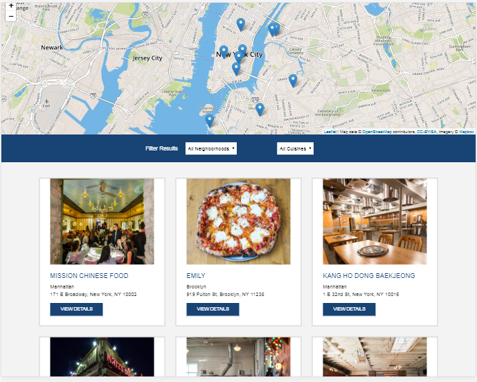

# Restaurant Reviews 
---

The started code is forked from Udacity for a restaurant reviews website.
The project work has improved below three areas:
- Responsive Design,
- Accessibility and
- Offline Use.

## How to launch the app locally?
1. Clone the repo
2.  Using Terminal enter into project directory
3.  In a terminal, check the version of Python you have: `python -V`.
4. If you have Python 2.x, spin up the server with `python -m SimpleHTTPServer 3000` (or some other port, if port 8000 is already in use.)
5.  For Python 3.x, you can use `python -m http.server 3000`.

6.  With your server running, visit the site: `http://localhost:3000`

## Credits

* Starter code by [**Udacity**](https://github.com/udacity/mws-restaurant-stage-1).

## Screenshot

